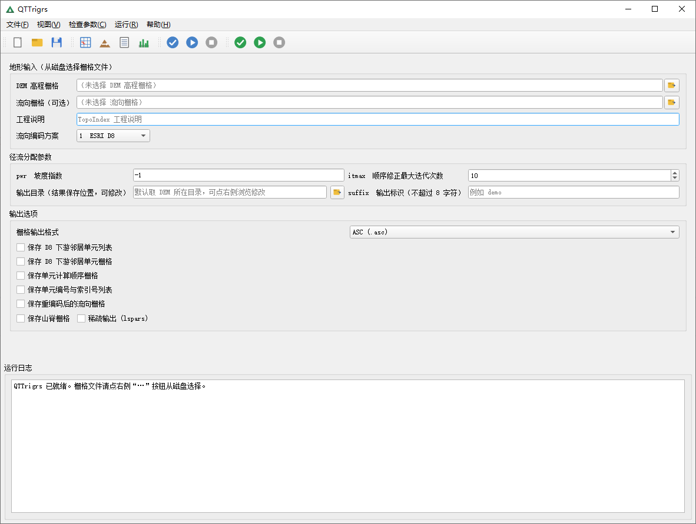
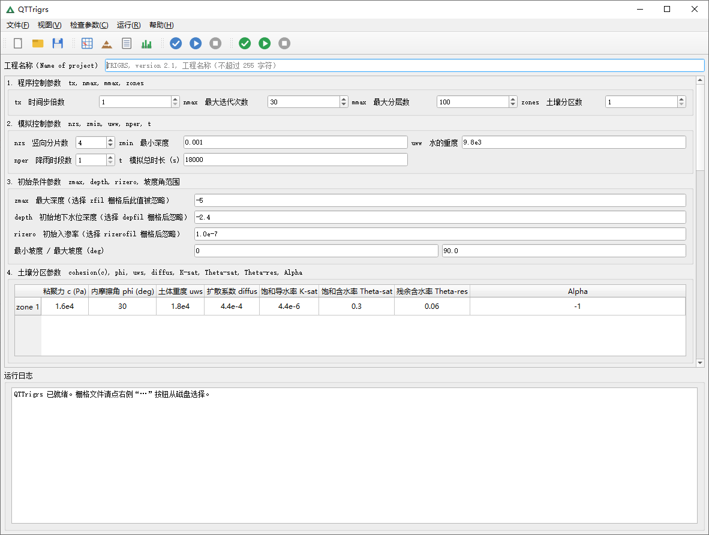
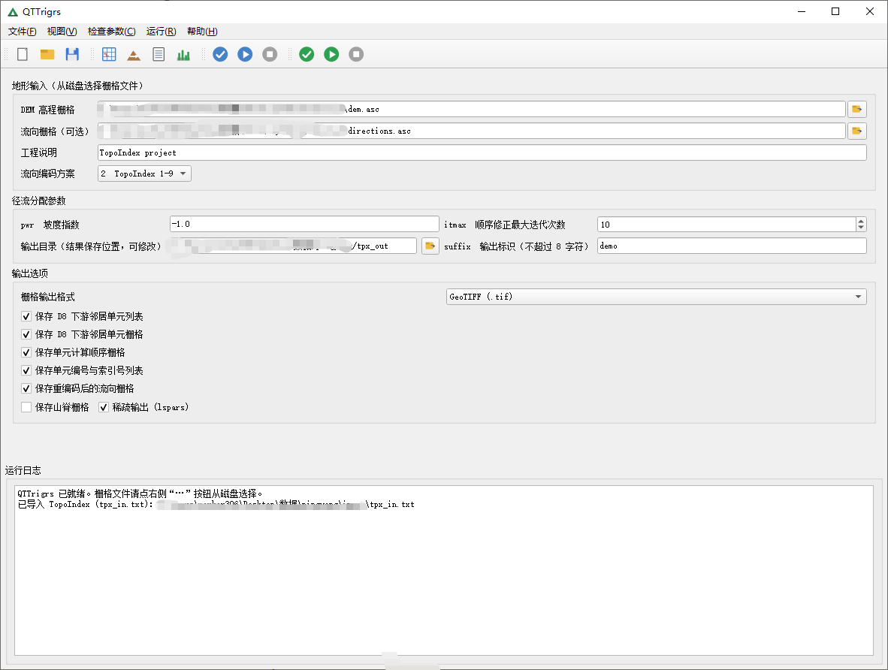
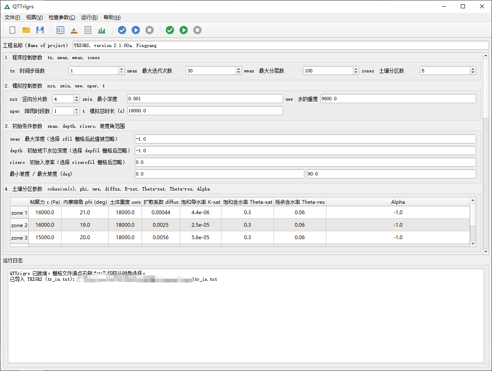
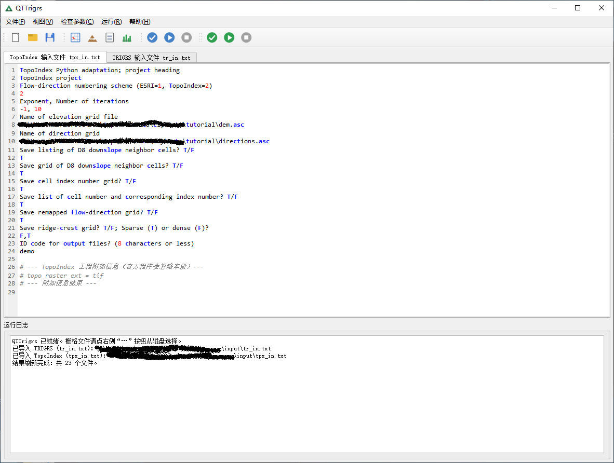
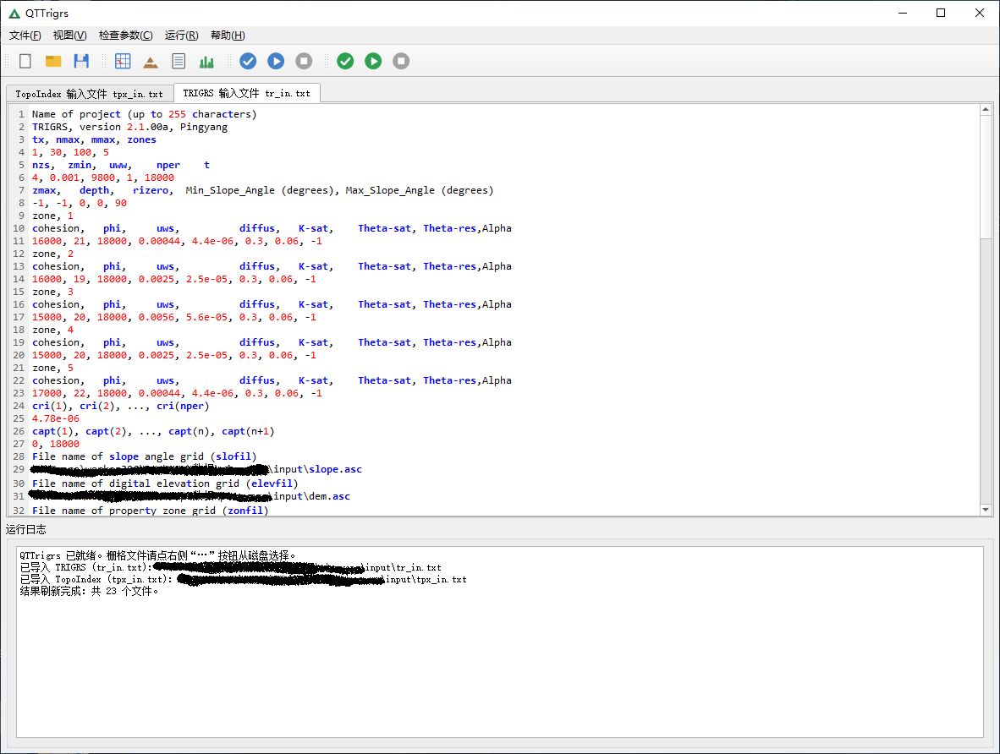
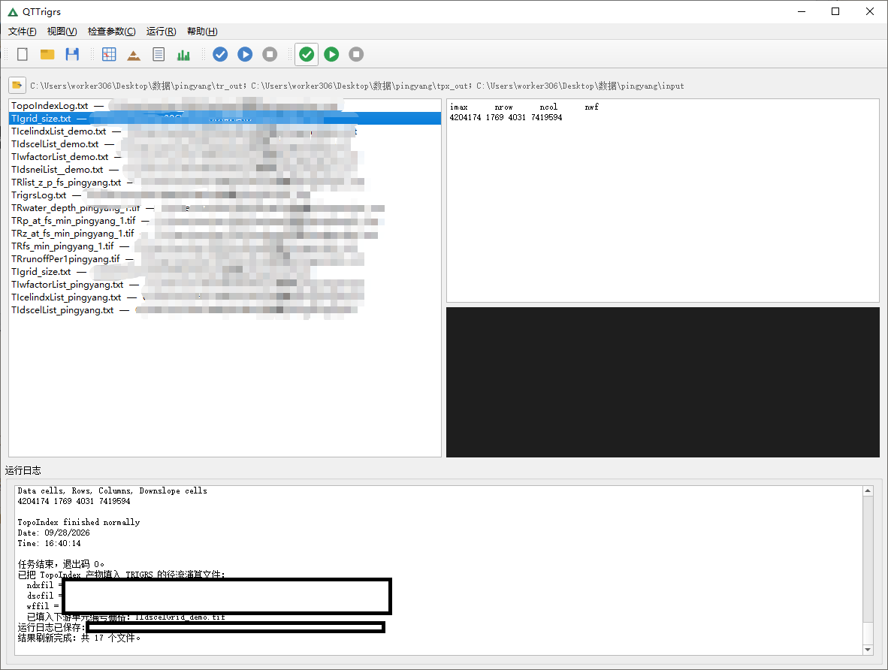
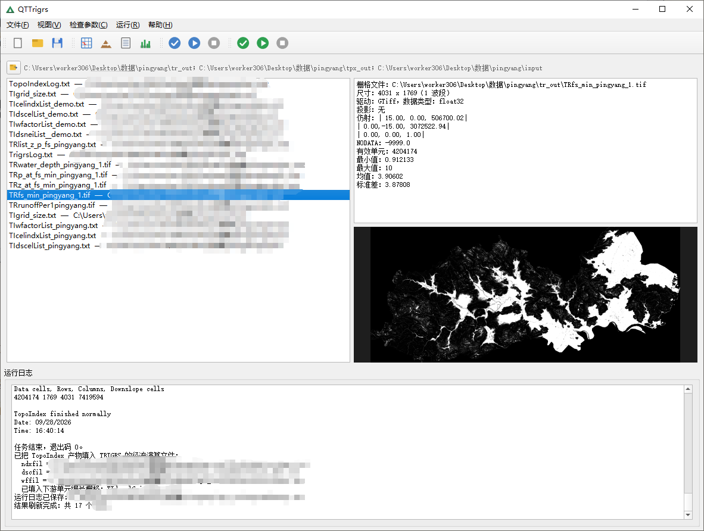

# QTTrigrs 使用手册

**TRIGRS（含 TopoIndex）独立桌面程序** 

---

## 目录

1. [这是什么](#1-这是什么)
2. [致谢与版权](#2-致谢与版权)
3. [功能特性](#3-功能特性)
4. [系统要求与安装](#4-系统要求与安装)
5. [快速开始](#5-快速开始)
6. [界面说明](#6-界面说明)
7. [标准工作流](#7-标准工作流)
8. [TopoIndex 参数（tpx_in.txt）](#8-topoindex-参数tpx_intxt)
9. [TRIGRS 参数（tr_in.txt）](#9-trigrs-参数tr_intxt)
10. [输出文件](#10-输出文件)
11. [常见问题与故障排查](#11-常见问题与故障排查)
12. [源码目录结构](#12-源码目录结构)
13. [重新编译 Fortran 内核](#13-重新编译-fortran-内核)
14. [打包成独立程序（Nuitka）](#14-打包成独立程序nuitka)
15. [做成安装包（Inno Setup）](#15-做成安装包inno-setup)
16. [许可](#16-许可)

---

## 1. 这是什么

QTTrigrs 把美国地质调查局（USGS）的两个边坡稳定性模型抽出来，做成一个**独立的桌面程序**：

| 模型 | 作用 |
| --- | --- |
| **TopoIndex** | 地形指数分析：对 DEM 做高程排序、找 D8 下游单元、计算坡面径流分配权重，产出 TRIGRS 需要的径流汇流文件。 |
| **TRIGRS** | 瞬态降雨入渗 + 区域边坡稳定性：按降雨过程逐时步求解压力水头与安全系数，产出最小安全系数等栅格。 |





程序**完全兼容官方文件格式**：输入是官方 `tpx_in.txt` / `tr_in.txt`，输出文件名也与官方一致，
因此可以和原版 USGS 程序互相打开、互相校验。

与官方程序的区别只在于**实现方式**：

- 求解全部用 **Fortran** 重写并编译成 `f2py` 扩展（`.pyd`），在**进程内后台线程**运行，
  调用期间释放 GIL，界面不会卡死；
- 栅格读写改用 **rasterio**）；
- 界面从 QGIS 插件改为独立 PyQt5 程序，栅格直接从磁盘选择。

算法、参数含义、单位、输出格式都与官方保持一致。

---

## 2. 致谢与版权

**本程序的全部算法与输入/输出格式都来自官方程序**，代码只是把求解部分重新实现、把界面改成独立程序。
原始模型与算法版权归原作者所有，特此郑重致谢：

### TRIGRS

> *Transient Rainfall Infiltration and Grid-Based Regional Slope-Stability Model*

作者：**Rex L. Baum**、William Z. Savage、Jonathan W. Godt
（U.S. Geological Survey，美国地质调查局）
参考版本：官方 TRIGRS 2.1（2010）

### TopoIndex

> *Topographic Indexing and flow distribution factors for routing runoff through Digital Elevation Models*

作者：**Rex L. Baum**（U.S. Geological Survey）
参考版本：官方 TopoIndex 1.0.15

USGS 的软件属于美国联邦政府作品，为**公有领域（public domain）**，可自由使用与再分发。
感谢 USGS 长期公开这两个模型与文档，本程序才得以实现。

程序内的 **“帮助 → 关于”** 也完整保留了以上署名，并附全部参数说明。

---

## 3. 功能特性

- 两页参数界面：**TopoIndex 地形指数** / **TRIGRS 模型**，外加**输入文件预览**页。
- **四条独立的工具栏**（工程 / 视图 / TopoIndex / TRIGRS），每条都可拖动、可浮动分离；
  菜单栏含 **视图 / 检查参数 / 运行 / 帮助**，两个模型的操作分开放。
- 栅格直接从磁盘选择（路径框 + 浏览按钮），不再依赖 QGIS 工程图层。
- **检查参数**：运行前校验必填项、文件存在性、数值范围，并给出中文提示。
- **运行日志**：Python 与 Fortran 的输出统一捕获到同一个日志面板；运行结束后日志可落盘。
- **运行结果预览**：扫描输出目录，列出产物，文本文件直接看内容、栅格显示缩略图与统计。
- 运行在**后台线程**：TopoIndex / TRIGRS 计算期间界面保持响应，可随时点击**停止**。
- 结果保存位置**分别在两页设置**：TopoIndex 页与 TRIGRS 页各有自己的输出目录。

---

## 4. 系统要求与安装

### 运行环境

| 项 | 要求 |
| --- | --- |
| 操作系统 | Windows 10/11 64 位 |
| Python | **3.12**（Fortran 内核 `_trigrs_native` / `topoindex` 均为 `cp312-win_amd64`） |
| 依赖 | `numpy`、`scipy`、`rasterio`、`PyQt5`（见 `requirements.txt`） |
| 其他 | `lib/` 内的 gfortran 运行时 DLL（随程序附带，无需单独安装 gfortran） |

### 安装

```bat
:: 1) 建一个 Python 3.12 环境（conda 或 venv 均可）
conda create -n qtgrs python=3.12 -y
conda activate qtgrs

:: 2) 安装依赖
pip install -r requirements.txt
```

### 运行

```bat
python main.py
```

> **注意**：请使用 **64 位 Python 3.12**。如果你的 Python 不是 3.12，`.pyd` 内核无法加载，
> 需要按 [第 13 节](#13-重新编译-fortran-内核)重新编译。

---

## 5. 快速开始

以一个 DEM 为例，最小流程如下：

1. 启动程序 `python main.py`。
2. 菜单 **视图 → TopoIndex**，切到 TopoIndex 页。
3. 选择 **DEM 高程栅格**；若有流向栅格一并选择，并确认 **流向编码方案**（见下）。
4. 点击 **检查参数**，确认没有报错。
5. 点击 **运行 TopoIndex**。大网格需要几分钟（主要在写列表文件），日志里会有进度提示。
6. 运行结束后，产物会写入 TopoIndex 页设置的输出目录，并**自动回填**到 TRIGRS 页的
   `nxtfil / ndxfil / dscfil / wffil`。
7. 菜单 **视图 → TRIGRS 模型**，切到 TRIGRS 页。
8. 选择坡度 / 高程等栅格、填写土壤与降雨参数，点击 **检查参数**。
9. 点击 **开始计算**，等待完成；结果栅格写入 TRIGRS 页设置的输出目录。

### 两个最容易踩的坑

| 坑 | 说明 |
| --- | --- |
| **流向编码方案（aif）选错** | 流向栅格的数值是 `1/2/4/8/16/32/64/128`（2 的幂）时选 **1 ESRI D8**；是 `1–9` 时选 **2 TopoIndex 1-9**。选错会算错流向。 |
| **itmax 太小** | TopoIndex 的 `itmax` 是顺序修正的迭代次数，需要的次数≈最长流路的单元数。几十万到几百万单元的大 DEM 往往需要**上千次**（例：1769×4031 的网格实测需要 ≈1280）。太小会提示“未收敛”，且不会生成后续产物。 |

---

## 6. 界面说明

### 6.1 工具栏与菜单

顶部有 **四条工具栏**：**工程 / 视图 / TopoIndex / TRIGRS**。

- 每条工具栏都是**独立、可拖动、可浮动（可分离）**的：按住左侧拖动柄可以把它拖到窗口
  任意一边，或拖出窗口变成浮动小面板，再拖回去即还原；也可以把几条并成一排。
- 两个模型的操作彻底分开，TopoIndex 排在 TRIGRS 前面（先做地形指数，再跑 TRIGRS）。
- 按钮都是纯图标，悬停有提示。

| 工具栏 | 按钮 | 作用 |
| --- | --- | --- |
| **工程** | 新建工程 | 清空当前所有参数与文件选择 |
| | 导入工程 | 打开 `tr_in.txt` / `tpx_in.txt`，按其中记录的路径恢复栅格选择 |
| | 导出工程 | 把当前参数写成官方格式的 `tr_in.txt` / `tpx_in.txt` |
| **视图** | TopoIndex 地形指数 / TRIGRS 模型 / 输入文件预览 / 结果预览 | 在四个页面之间切换 |
| **TopoIndex** | 检查参数 | 校验 TopoIndex 参数 |
| | 运行 TopoIndex | 运行 TopoIndex |
| | 停止 | 停止当前任务（在**当前步骤结束后**停止） |
| **TRIGRS** | 检查参数 | 校验 TRIGRS 参数 |
| | 开始计算 | 运行 TRIGRS |
| | 停止 | 同上 |

菜单栏：

| 菜单 | 内容 |
| --- | --- |
| **文件** | 新建 / 导入 / 导出工程；生成 `tpx_in.txt` 预览；生成 `tr_in.txt` 预览；退出 |
| **视图** | TopoIndex 地形指数 / TRIGRS 模型 / 输入文件预览 / 结果预览 |
| **检查参数** | 检查 TopoIndex 参数 / 检查 TRIGRS 参数 |
| **运行** | 运行 TopoIndex / 开始计算（TRIGRS）/ 停止 |
| **帮助** | 关于 QTTrigrs / TopoIndex 参数说明 / TRIGRS 参数说明 |

> “帮助”菜单里的后两项，分别打开 **TopoIndex 全部参数** 与 **TRIGRS 全部参数** 的说明
> 对话框（“关于”里还完整保留了 USGS 官方作者的署名致谢），可随时对照官方文档查参数含义。

### 6.2 TopoIndex 页

- **地形输入**：DEM 高程栅格（必填）、流向栅格（可选）、工程说明、流向编码方案。
- **径流分配参数**：`pwr` 坡度指数、`itmax` 迭代次数、输出目录、`suffix` 输出标识。
- **输出选项**：栅格输出格式（ASC / TIF）与 6 个保存开关。



### 6.3 TRIGRS 页

按官方 `tr_in.txt` 的顺序分 6 组：程序控制参数、模拟控制参数、初始条件参数、
土壤分区参数、降雨参数、栅格输入；下面还有输出选项与 SCOOPS 深层估计。



### 6.4 输入文件预览页

实时显示当前参数将写出的 `tr_in.txt` / `tpx_in.txt` 全文，可直接对照官方文档核对。





### 6.5 结果预览页

点击 **刷新结果** 扫描输出目录，左侧列出产物文件：

- 文本文件（`*.txt`）：直接显示内容；
- 栅格文件（`*.asc` / `*.tif`）：显示表头、尺寸、统计信息与灰度缩略图。





### 6.6 运行日志

底部的 **运行日志** 面板汇总 Python 与 Fortran 的全部输出。运行结束后，日志会保存为
输出目录下的 `TopoIndexLog.txt` / `TrigrsLog.txt`。

```txt
TopoIndex: Topographic Indexing and
 flow distribution factors for routing
 runoff through Digital Elevation Models
            By Rex L. Baum
       U.S. Geological Survey
       & Jbc, NanChang University
    Python Version 1.0.14, 11May2015
-----------------------------------------
Reading elevation grid data
Initial elevation indexing completed
Reading flow-direction data
Converting directional data
Writing raster grid
Raster grid saved successfully
Finding D8 neighbor cells（写 TIdsneiList 列表，大网格约 1 分钟，请耐心等待）
Correcting cell index numbers（itmax=1280，约 30 秒，请耐心等待）
Computing weighting factors（写 TIdscelList / TIwfactorList，大网格约 2 分钟，请耐心等待）
Saving results to disk
Writing raster grid
Raster grid saved successfully
Writing raster grid
Raster grid saved successfully
Writing cell number and index list
Cell number and index list saved
Writing grid size parameters
TopoIndex finished normally

Starting TopoIndex
Version: 1.0.14, 11May2015
Date: 09/28/2026
Time: 16:36:57

-- LISTING OF INITIALIZATION DATA --
TopoIndex Python adaptation; project heading
TopoIndex project
Flow-direction numbering scheme (ESRI=1, TopoIndex=2)
1
Exponent, Number of iterations
-1.00000000            1280
Name of elevation grid file
%数据位置%\dem.asc
Name of direction grid
%数据位置%\directions.asc
Save listing of D8 downslope neighbor cells? T/F
T
Save grid of D8 downslope neighbor cells? T/F
T
Save cell index number grid? T/F
T
Save list of cell number and corresponding index number? T/F
T
Save remapped flow-direction grid? T/F
T
Save ridge-crest grid? T/F; Sparse (T) or dense (F)?
F
Path to elevation grid and output files
%数据位置%
ID code for output files? (8 characters or less)
demo
-- END OF INITIALIZATION DATA --

TopoIndex project


Parameters for file--> %数据位置%\dem.asc
Data cells, Rows, Columns
4204174 1769 4031
Reading flow-direction data
Converting directional data from ESRI to TopoIndex
Writing raster grid to: %输出位置%\TIflodirGrid_demo.tif
Raster grid saved successfully: %输出位置%\TIflodirGrid_demo.tif
Converted flow direction grid saved.
         Listing of grid mismatches
Mismatch counter, Row, Column, Direction code
0,  --,   --,  --
No grid mismatch found!
Subroutine nxtcel completed normally
Subroutine slofac completed normallyWriting raster grid to: %输出位置%\TIdscelGrid_demo.tif
Raster grid saved successfully: %输出位置%\TIdscelGrid_demo.tif
Writing raster grid to: %输出位置%\TIcelindxGrid_demo.tif
Raster grid saved successfully: %输出位置%\TIcelindxGrid_demo.tif
Cell number and index list saved: %输出位置%\TIcelindxList_demo.txt
Parameters for file--> %数据位置%\dem.asc
Exponent -1.0
Data cells, Rows, Columns, Downslope cells
4204174 1769 4031 7419594

TopoIndex finished normally
Date: 09/28/2026
Time: 16:40:14


```


---

## 7. 标准工作流

```text
DEM (+流向栅格)
      │
      ▼
┌───────────────┐   TIdsneiList / TIdscelGrid / TIcelindxGrid /
│   TopoIndex   │ → TIcelindxList / TIflodirGrid / TIdscelList /
└───────────────┘   TIwfactorList / TIgrid_size.txt
      │
      │  自动回填：nxtfil, ndxfil, dscfil, wffil
      ▼
┌───────────────┐   TRfsmin / TRzfmin / TRpmin / TRwtab /
│    TRIGRS     │ → TRrunoffPer* / TRinfilratPer* / 列表输出
└───────────────┘
      │
      ▼
  结果栅格 / 列表 / 日志
```

TopoIndex 产出的四个径流汇流文件（`TIdscelGrid` / `TIcelindxList` / `TIdscelList` /
`TIwfactorList`）连同 `TIgrid_size.txt` 是 TRIGRS 做径流演算的输入；四者齐全时 TRIGRS
才会执行径流演算，否则跳过该步骤（仍会做入渗与稳定性计算）。

---

## 8. TopoIndex 参数（tpx_in.txt）

官方输入文件是“说明行 + 取值行”交替的 12 组，程序按行序读取，说明行只作注释。

| 参数 | 含义 | 取值 / 说明 |
| --- | --- | --- |
| `heading` | 工程说明（Name of project） | 任意文本，最长 255 字符，仅作标识。 |
| `aif` | 流向栅格的编码方案 | **1 = ESRI D8**（1/2/4/8/16/32/64/128）；**2 = TopoIndex**（1–9）。<br>选 1 时程序把 ESRI 编码换算成 1–9；选 2 时按 1–9 原样使用。**选错会算错流向。** |
| `pwr` | 坡度指数，控制径流如何分配给下游单元 | `> 20` 退化为 D8（全部走最陡）；`= 0` 下游单元**均匀**分配；`= 1` 按**坡度**成比例；`0 < pwr ≤ 20` 按坡度的 `pwr` 次幂；`< 0` 启用 **D-infinity**。 |
| `itmax` | 单元顺序修正的最大迭代次数 | 需要的次数≈最长流路的单元数。小网格 10 即可；几百万单元的大 DEM 往往需要**上千次**。不够会提示“未收敛”，且不生成后续产物。 |
| `demfil` | DEM 高程栅格文件 | ASCII Grid 或 GeoTIFF。输出栅格继承它的行列数、仿射变换与投影。 |
| `dirfil` | 流向栅格文件（可选） | 留空时只输出 `TIgrid_size.txt`，不做后续分析。 |
| `op(1)` | 保存 **D8 下游邻居单元列表** | T/F。产物 `TIdsneiList_<suffix>.txt`。 |
| `op(2)` | 保存 **D8 下游邻居单元栅格** | T/F。产物 `TIdscelGrid_<suffix>.asc\|.tif`（即 TRIGRS 的 `nxtfil`）。 |
| `op(3)` | 保存 **单元计算顺序栅格** | T/F。产物 `TIcelindxGrid_<suffix>.asc\|.tif`。 |
| `op(4)` | 保存 **单元编号与索引号列表** | T/F。产物 `TIcelindxList_<suffix>.txt`（即 `ndxfil`）。 |
| `op(5)` | 保存 **重编码后的流向栅格** | T/F，仅 `aif=1` 有意义。产物 `TIflodirGrid_<suffix>.asc\|.tif`。 |
| `op(6)` | 保存 **山脊栅格** | T/F。产物 `TIridge_crest_<suffix>.asc\|.tif`。`pwr < 0` 时无法计算山脊，即使勾选也不生成。 |
| `lspars` | 山脊是否**稀疏**输出 | T = 稀疏（阈值 6），F = 密集（阈值 5）。 |
| `suffix` | 输出文件名标识 | 不超过 8 字符，拼进所有产物文件名。 |

---

## 9. TRIGRS 参数（tr_in.txt）

参数名与官方说明行一致，顺序与官方 `tr_in.txt` 相同。角度类参数在界面填**度**，写文件与送入
内核前换算成弧度（与官方一致）。

### 9.1 程序控制参数

| 参数 | 含义 | 说明 |
| --- | --- | --- |
| `title` | 工程名称 | 任意文本，最长 255 字符。 |
| `tx` | 时间步倍数 | 每个降雨时段再细分 `tx` 个时间步。非饱和模型会按最小输出间隔自动增大。 |
| `nmax` | 求解压力水头的最大迭代次数 | 整数。 |
| `mmax` | 竖向最大分层数 | 有限深度求解器的竖直层数上限。 |
| `zones` | 土壤分区数 | 与 `zonfil` 的分区数一致；土壤参数表要有 `zones` 行。 |

### 9.2 模拟控制参数

| 参数 | 含义 | 说明 |
| --- | --- | --- |
| `nzs` | 竖向分片数 | 有限深度求解的竖直离散数。 |
| `zmin` | 最小计算深度 (m) | 默认 0.001。 |
| `uww` | 水的重度 (N/m³) | 默认 9.8e3。 |
| `nper` | 降雨时段数 | `cri` / `rifil` 要 `nper` 项，`capt` 要 `nper+1` 项。 |
| `t` | 模拟总时长 (s) | 默认 18000。 |

### 9.3 初始条件参数

| 参数 | 含义 | 说明 |
| --- | --- | --- |
| `zmax` | 最大深度 (m) | 填**负值**表示改读 `zfil` 栅格。 |
| `depth` | 初始地下水位深度 (m) | 填**负值**表示改读 `depfil` 栅格。 |
| `rizero` | 初始入渗率 (m/s) | 填**负值**表示改读 `rizerofil` 栅格。 |
| `slomin` | 最小坡度角 (°) | 默认 0。 |
| `slomax` | 最大坡度角 (°) | 默认 90。 |

### 9.4 土壤分区参数（每行 8 个值，共 `zones` 行）

| 列 | 含义 |
| --- | --- |
| `cohesion` | 粘聚力 c (Pa) |
| `phi` | 内摩擦角 φ (°) |
| `uws` | 土体重度 γs (N/m³) |
| `diffus` | 水力扩散系数 D (m²/s) |
| `K-sat` | 饱和导水率 Ks (m/s) |
| `Theta-sat` | 饱和含水率 θs |
| `Theta-res` | 残余含水率 θr |
| `Alpha` | Gardner 参数 α (1/m) |

### 9.5 降雨参数

| 参数 | 含义 | 说明 |
| --- | --- | --- |
| `cri(i)` | 第 i 时段降雨强度 (m/s) | 共 `nper` 项。填**负值**表示该时段改读 `rifil(i)` 栅格。 |
| `capt(i)` | 时段边界时刻 (s) | 共 `nper+1` 项，必须单调递增。 |
| `rifil(i)` | 第 i 时段降雨强度栅格 | 可选，与 `cri(i)` 二选一。 |

### 9.6 栅格输入

| 参数 | 含义 |
| --- | --- |
| `slofil` | 坡度角栅格 |
| `elevfil` | 高程栅格 |
| `zonfil` | 属性分区栅格（值与土壤参数行号对应） |
| `zfil` | 最大深度栅格（替代标量 `zmax`） |
| `depfil` | 初始地下水位深度栅格（替代标量 `depth`） |
| `rizerofil` | 初始入渗率栅格（替代标量 `rizero`） |

### 9.7 径流汇流文件（一般由 TopoIndex 自动回填）

| 参数 | 含义 | 对应的 TopoIndex 产物 |
| --- | --- | --- |
| `nxtfil` | D8 下游单元编号栅格 | `TIdscelGrid_*` |
| `ndxfil` | 径流计算顺序单元列表 | `TIcelindxList_*` |
| `dscfil` | 全部下游受体单元列表 | `TIdscelList_*` |
| `wffil` | 径流权重因子列表 | `TIwfactorList_*` |

### 9.8 输出选项

| 参数 | 含义 | 说明 |
| --- | --- | --- |
| `folder` | 输出文件夹 | 结果存放目录，必须存在。 |
| `suffix` | 输出文件名标识 | 拼进所有结果文件名。 |
| `rodoc` | 保存径流栅格 | T/F。产物 `TRrunoffPer*`。 |
| `outp(2)` | 保存**最小安全系数**栅格 | T/F。产物 `TRfsmin*`。 |
| `outp(3)` | 保存**最小安全系数对应深度**栅格 | T/F。产物 `TRzfmin*`。 |
| `outp(4)` | 保存**最小安全系数处压力水头**栅格 | T/F。产物 `TRpmin*`。 |
| `outp(1)` | 保存**计算的地下水位**栅格 | T/F，后接 `depth` 或 `eleva`。 |
| `outp(5)` | 保存**实际入渗率**栅格 | T/F。产物 `TRinfilratPer*`。 |
| `outp(6)` | 保存**非饱和区基底通量**栅格 | T/F。 |
| `flag` | 压力水头 / 安全系数**列表输出**模式 | `-1` Z-P-Fs 列表；`-2` 详细 Z-P-Fs；`-3` Z-P-Fs-饱和度；`-4` 完整 ijz；`-5` 降采样 ijz；`-6` 稀疏 ijz；`-7` 完整 xmdv；`-8` 降采样 xmdv；`-9` 稀疏 xmdv；`0` 不输出。 |
| `spcg` | 降采样间隔 | 配合 `-5` / `-8`。 |
| `nout` | 输出次数 | 与 `tsav` 配对。 |
| `tsav` | 输出时刻 (s)，逗号分隔 | 在这些时刻保存结果。 |
| `lskip` | 跳过其它时间步 | T = 只在 `tsav` 时刻求解输出。 |
| `lany` | 使用可填充孔隙度解析解 | T/F。 |
| `llus` | 估算上升地下水位区的正压力水头 | T/F。 |
| `lps0` | 取 `psi0 = -1/alpha` | T = 用 `-1/α`；F = 用默认 `psi0 = 0`。 |
| `outp(8)` | 记录质量平衡结果 | T/F。 |
| `flowdir` | 流向选项 | `gener` / `slope` / `hydro`。 |
| `bkgrof` | 零降雨期计入稳态背景通量 | T/F。 |
| `lasc` | 输出栅格扩展名 | T = `.asc`；F = `.tif`。 |
| `lpge0` | 计算安全系数时忽略负压力水头 | 仅饱和入渗，T/F。 |
| `igcapf` | 忽略毛细带水高度 | 非饱和入渗，T/F。 |

### 9.9 SCOOPS 深层压力水头估计

| 参数 | 含义 | 说明 |
| --- | --- | --- |
| `deepz` | 地表以下深度 (m) | 正值启用；填**负值**取消该选项（界面默认 -50.0 即关闭）。 |
| `deepwat` | 压力选项 | `zero` / `flow` / `hydr` / `relh`。 |

---

## 10. 输出文件

### 10.1 TopoIndex

| 文件 | 说明 |
| --- | --- |
| `TIdsneiList_<suffix>.txt` | D8 下游邻居列表 |
| `TIdscelGrid_<suffix>.asc\|.tif` | D8 下游单元编号栅格（TRIGRS 的 `nxtfil`） |
| `TIcelindxGrid_<suffix>.asc\|.tif` | 单元计算顺序栅格 |
| `TIcelindxList_<suffix>.txt` | 单元编号 ↔ 计算顺序列表（`ndxfil`） |
| `TIflodirGrid_<suffix>.asc\|.tif` | 重编码流向栅格 |
| `TIridge_crest_<suffix>.asc\|.tif` | 山脊栅格（需 `pwr ≥ 0`） |
| `TIdscelList_<suffix>.txt` | 全部下游受体单元列表（`dscfil`，总是生成） |
| `TIwfactorList_<suffix>.txt` | 径流权重因子列表（`wffil`，总是生成） |
| `TIgrid_size.txt` | `imax nrow ncol nwf`（有效单元数、行列数、下游单元总数） |
| `TopoIndexLog.txt` | 运行日志 |

> 栅格产物只写 `.asc` 或 `.tif`。列表类产物本来就是纯文本，始终是 `.txt`。

### 10.2 TRIGRS

| 文件 | 说明 |
| --- | --- |
| `TRfsmin<suffix>` | 最小安全系数栅格 |
| `TRzfmin<suffix>` | 最小安全系数出现处的深度栅格 |
| `TRpmin<suffix>` | 最小安全系数处的压力水头栅格 |
| `TRwtab<suffix>` | 计算的地下水位（埋深或高程） |
| `TRrunoffPer<n><suffix>` | 第 n 时段径流栅格 |
| `TRinfilratPer<n><suffix>` | 第 n 时段实际入渗率栅格 |
| `TRzpf<suffix>.txt` | Z-P-Fs 等列表输出（由 `flag` 决定） |
| `TrigrsLog.txt` | 运行日志 |

---

## 11. 常见问题与故障排查

### TopoIndex 提示“correct_order 未收敛”

`itmax` 太小。顺序修正每迭代一次把排序沿流路推进一格，大 DEM 的流路很深，需要的次数很大。
**把 itmax 调大**（例：420 万单元的 DEM 实测需要 ≈1280）。

### 只生成了两个产物（`TIdsneiList` 和 `TIflodirGrid`）

同上：`correct_order` 未收敛时程序会提前结束，因此 `correct_order` **之后**的产物
（`TIdscelGrid` / `TIcelindxGrid` / `TIcelindxList` / `TIdscelList` / `TIwfactorList` /
`TIgrid_size.txt`）都不会生成。调大 `itmax` 即可全部产出。

### 运行时间很长（几分钟）

大网格的绝大部分时间花在**写列表文件**上（`TIdsneiList`、`TIdscelList`、`TIwfactorList`
往往各几百 MB）。以 420 万单元的 DEM 为例：求解约 30 秒，其余数分钟都在写文件。
日志里会给每一步的耗时提示，不是卡死。

### `TIgrid_size.txt` 里没有内容 / 日志里没有 “Data cells, Rows, Columns, Downslope cells”

该文件写在 `correct_order` 之后，未收敛时不会生成，见上一条。

### 勾了“保存山脊栅格”却没有 `TIridge_crest_*`

`pwr < 0`（D-infinity）时无法计算山脊，即使勾选也不会生成。

### 流向明显算错 / 结果不合理

优先检查 **流向编码方案**：
- 流向栅格是 `1/2/4/8/16/32/64/128` → 选 **1 ESRI D8**；
- 流向栅格是 `1–9` → 选 **2 TopoIndex 1-9**。

选错会把流向算错，进而整条链路都不对。

### TRIGRS 提示“略过径流演算过程”

四个径流文件（`nxtfil`/`ndxfil`/`dscfil`/`wffil`）或 `TIgrid_size.txt` 不全。先用 TopoIndex
生成并自动回填，或手动选择这四个文件。

### 界面提示某个栅格“（文件不存在）”

路径失效（文件被移动/删除）。重新选择文件即可。

### `.pyd` 加载失败 / `ImportError`

Python 版本不是 **3.12**，或 `lib/` 下的 gfortran DLL 缺失。请用 3.12，或按
[第 13 节](#13-重新编译-fortran-内核)重新编译内核。

---

## 12. 源码目录结构

```text
QTTrigrs/
├── main.py                        入口（python main.py）
├── requirements.txt               运行依赖
├── README.md                      本手册
├── lib/                           gfortran 运行时 DLL（trigrs 与 topoindex 共用）
├── log_control.py                 日志捕获（Python print + Fortran write(*,*)）
├── run_control.py                 停止信号 / 让出控制权
│
├── trigrs/                        TRIGRS 模型
│   ├── Trigrs.py                  主程序（IO 编排 + 调 Fortran 内核 + 列表输出）
│   ├── trigrs_fortran.py          Python 胶水层（读栅格/径流 → 调内核 → 写回）
│   ├── trigrs_f2py/               Fortran(f2py) 力学内核
│   │   ├── src/                   Fortran 源（xxx_f2py.<扩展名>）
│   │   ├── build.py               构建脚本（f2py + Meson/Ninja）
│   │   └── _trigrs_native.cp312-win_amd64.pyd
│   ├── TrigrsInputFile.py         tr_in.txt 生成/解析
│   ├── TrigrsIO/                  输入输出
│   ├── TrigrsModule/              数据类（Grids / InputVars / ModelVars / InputFileDefs）
│   ├── TrigrsSubroutine/          栅格/列表读写（仅 IO）
│   └── TrigrsUtils/               日志 / 初始化
│
├── topoindex/                     TopoIndex 地形指数
│   ├── topoindex.py               主流程（解析 → 排序 → 找下游 → 权重 → 写产物）
│   ├── TopoIndexInputFile.py      tpx_in.txt 生成/解析
│   ├── topo_rewrite/              栅格读写（rasterio 版）
│   ├── topo_utils/                日志 / 错误处理
│   └── topoindex_f2py/            Fortran(f2py) 内核
│       ├── src/                   Fortran 源
│       ├── build.py               构建脚本
│       └── topoindex.cp312-win_amd64.pyd
│
├── ui/                            PyQt5 界面
│   ├── QTrigrsWindow.ui/.py       界面定义（.ui 为准，改动后需重新生成 .py）
│   ├── trigrs_controller.py       控制器（主窗口 / 参数收集 / 运行 / 日志 / 结果）
│   ├── about_dialog.py            关于对话框（署名致谢 + 全部参数说明）
│   ├── QTrigrsTextBrowser.py      输入文件预览控件
│   └── file_picker.py             栅格文件选择控件
│
├── build_nuitka.py                打包脚本（Nuitka，尽量小）
├── installer/                     安装包（Inno Setup）
│   ├── QTTrigrs.iss               安装脚本
│   ├── LICENSE.txt                安装时展示的许可 / 致谢
│   ├── ChineseSimplified.isl      简体中文安装界面
│   └── build_installer.cmd        双击即可编译安装包
└── resources/
    ├── icons/                     工具栏 / 窗口图标（含 app.ico，打包用）
    └── make_icons.py              生成图标的脚本
```

---

## 13. 重新编译 Fortran 内核

只在需要更换 Python/NumPy 版本、或修改了 Fortran 源码时才需要。

### 前置要求

- Python 3.12 + `numpy` + `meson` + `ninja`
- MinGW-w64 的 `gcc` / `gfortran` 在 `PATH` 上（例如 `C:\mingw64\bin`）

```bat
pip install numpy meson ninja
set PATH=C:\mingw64\bin;%PATH%
```

### 编译

```bat
:: TRIGRS 力学内核
cd trigrs\trigrs_f2py
python build.py

:: TopoIndex 内核
cd ..\..\topoindex\topoindex_f2py
python build.py
```

`build.py` 会自动：生成 f2py 签名 → 编译 → 把 `.pyd` 复制到包目录 → 把 gfortran
运行时 DLL 复制到项目根 `lib/` → 校验能否导入。

---

## 14. 打包成独立程序（Nuitka）

把整个程序打成一个不依赖本机 Python 的独立可执行文件，方便发给别人用。
脚本是 `build_nuitka.py`，目标是**体积尽量小**。

### 用法

```bat
pip install nuitka

python build_nuitka.py                :: 默认 standalone（文件夹，体积最小，推荐）
python build_nuitka.py --onefile      :: 单个 .exe
python build_nuitka.py --clean        :: 先清掉上次产物
python build_nuitka.py --console      :: 保留控制台窗口（调试用）
python build_nuitka.py --jobs 8       :: 并行编译
```

产物在 `dist/` 下：`dist/QTTrigrs.dist/QTTrigrs.exe`（standalone）或 `dist/QTTrigrs.exe`（onefile）。

### 环境要求

- Python 3.12（与两个 `.pyd` 内核的 cp312 ABI 一致）
- `pip install nuitka`
- **C 编译器**：优先用已装好的 **MSVC**（脚本用 `vswhere` 自动探测，不需要开“Developer 命令行”）；
  没装 MSVC 才会回退 `--mingw64`（首次会下载约 100 MB 的 MinGW）

### 体积是怎么压下来的

| 手段 | 说明 |
| --- | --- |
| `--noinclude-qt-translations` | 不带 Qt 翻译文件 |
| `--noinclude-qt-plugins=…` | 只留用得到的 Qt 插件（去掉 sql/打印/多媒体/WebEngine 等） |
| `--nofollow-import-to=…` | 不打包运行时用不到的库（tkinter / pytest / matplotlib / pandas …） |
| `--remove-output` | 打包完删掉中间 `.build` 目录 |
| **构建后裁剪**（`PRUNE_GLOBS`） | Nuitka 的 PyQt5 插件会把 Qt 的 DLL 一股脑塞进产物，而 `--noinclude-dlls` **管不到插件注入的 DLL**；所以打包完成后脚本再按名单删一遍：QtQuick/Qml、QtNetwork、OpenSSL、多媒体后端、用不到的图片格式插件、`opengl32sw.dll`（20 MB）等 |

实测数据：

| 场景 | 体积 |
| --- | --- |
| PyQt5 最小程序，裁剪前 → 裁剪后 | 60 MB → **44 MB** |
| 本程序，用 conda 的 MKL 版 numpy —— 不裁剪 | 523 MB |
| 本程序，用 conda 的 MKL 版 numpy —— 默认裁剪 | 348 MB |
| 本程序，用 conda 的 MKL 版 numpy —— 再 `--prune-mkl` | 331 MB |
| **本程序，用 pip 的 OpenBLAS 版 numpy —— 默认裁剪** | **167.8 MB** ← 推荐 |

> `--onefile` 没法做构建后裁剪（DLL 已被塞进单文件），所以体积会比 standalone 大。
> 想最小就用默认的 standalone。

### 怎么让包再小一点（重要）

本程序打包后仍有 300+ MB，**几乎全部是 numpy 背后那套 Intel MKL**：

```
mkl_core.2.dll      64 MB      mkl_intel_thread.2.dll  37 MB
mkl_avx2.2.dll      39 MB      mkl_def.2.dll           31 MB
mkl_rt.2.dll        27 MB      … 合计 260 MB+
```

这是**当前 conda 环境的 numpy 用了 MKL 版**导致的。想真正变小，用 **pip 装的 numpy**
（OpenBLAS 版，只有几十 MB）来打包即可，例如：

```bat
:: 建一个专门用来打包的干净环境
python -m venv .venv-pack
.venv-pack\Scripts\python -m pip install numpy==1.26.4 PyQt5 rasterio nuitka
:: 用这个环境跑打包脚本（.pyd 内核是 cp312，与 pip 的 numpy 1.26.4 ABI 一致）
.venv-pack\Scripts\python build_nuitka.py --clean
```

**实测：523 MB → 167.8 MB**，而且产物验证可用（exe 正常启动、两个 Fortran 内核都能加载并调用）。

167.8 MB 的构成（基本已经到极限）：

| 部分 | 体积 |
| --- | --- |
| `QTTrigrs.exe`（编译后的 Python 代码） | 21 MB |
| `rasterio.libs`（GDAL / PROJ / GEOS / SpatiaLite …） | 46 MB |
| `numpy.libs`（OpenBLAS） | 36 MB |
| 其余根目录（python312.dll + Qt5Core/Gui/Widgets + gfortran 运行时） | 32 MB |
| `rasterio` / `numpy` / `PyQt5` 包目录 | 32 MB |

> `rasterio.libs` 里那些看着「没用」的 DLL（spatialite / hdf5 / geos / netcdf / libxml2）
> **一个都不能删**——实测只要移走 spatialite，`import rasterio` 就直接 DLL load failed
> （GDAL 是直接链接它们的）。所以 167.8 MB 就是安全的下限。

`--prune-mkl` 是「不想换环境」时的折中：删掉按 CPU 分发的多余内核
（avx512 / mc3 / tbb_thread）以及 numpy 用不到的 ScaLAPACK / BLACS / MPI 部分，
省约 190 MB。**删的是按 CPU 分发的内核，请在目标机器上实测后再分发。**

### 打包产物里都带了什么

- `resources/`（界面图标）、`lib/`（gfortran 运行时，另会复制一份到 exe 旁边）
- `trigrs` / `topoindex` 两个包，含 `_trigrs_native` 与 `topoindex` 两个 `.pyd` 内核

打包后建议实测一遍：选 DEM、跑一次 TopoIndex，确认 Fortran 内核能正常加载
（若提示 DLL 找不到，把 `lib/*.dll` 复制到 exe 同目录即可）。

---

## 15. 做成安装包（Inno Setup）

在上一步的独立程序外面再套一个 Windows 安装包（开始菜单 / 桌面快捷方式、卸载项、
许可页），用 **Inno Setup 6** 制作。

### 制作

前置：先跑过 `build_nuitka.py`，有 `dist\main.dist\QTTrigrs.exe`。

```bat
:: 最简单：直接双击
installer\build_installer.cmd

:: 或者手动
"C:\Program Files (x86)\Inno Setup 6\ISCC.exe" installer\QTTrigrs.iss
```

产物：**`dist\installer\QTTrigrs-1.0.0-setup.exe`**

### 实测结果

| 项 | 结果 |
| --- | --- |
| 安装包体积 | **37.3 MB**（167.8 MB 用 lzma2/max 压出来） |
| 编译耗时 | 约 23 秒 |
| 安装后占用 | 171.4 MB |
| 静默安装 | `QTTrigrs-1.0.0-setup.exe /VERYSILENT /CURRENTUSER /DIR="..."` |
| 安装后运行 | exe 正常启动；两个 Fortran 内核都能加载调用 |
| 卸载 | 卸载程序退出码 0，目录清理干净 |

### 安装包都做了什么

- 默认装到 `Program Files\QTTrigrs`；向导里也可以选「仅为我安装」（不需要管理员权限）；
- 自动创建 **开始菜单**快捷方式，可选 **桌面**快捷方式；
- 安装前展示 **许可 / 致谢页**（`installer\LICENSE.txt`，含 USGS 官方作者署名）；
- 注册标准的 **卸载项**（控制面板 → 程序和功能）；
- 安装界面 **简体中文**（`installer\ChineseSimplified.isl`），也可切换 English；
- 只允许 64 位 Windows 10 及以上。

### 要改的地方

| 想改什么 | 改哪里 |
| --- | --- |
| 版本号 | `installer\QTTrigrs.iss` 顶部的 `#define MyAppVersion` |
| 发布者名称 | `#define MyAppPublisher`（同时写进 exe 属性） |
| 默认安装目录 | `DefaultDirName` |
| 许可页文字 | `installer\LICENSE.txt` |
| Inno Setup 安装路径 | `installer\build_installer.cmd` 里的 `ISCC=` |

> ⚠️ `AppId` 是固定 GUID，**不要改**——改了会被当成另一个程序，无法覆盖升级。

---

## 16. 许可

本程序是对 USGS TRIGRS 与 TopoIndex 的独立封装实现。**模型算法与输入/输出格式的版权归
USGS 及原作者所有**（USGS 软件为美国联邦政府作品，属公有领域）。使用本程序时请一并遵守
官方 TRIGRS / TopoIndex 的使用条款，并在任何基于本程序的成果中引用官方文献。

官方参考：

- Baum, R.L., Savage, W.Z., and Godt, J.W., 2008, *TRIGRS—A Fortran program for transient
  rainfall infiltration and grid-based regional slope-stability analysis, version 2.0*:
  U.S. Geological Survey Open-File Report 2008–1159.
- Baum, R.L., Godt, J.W., and Savage, W.Z., 2010, *Estimating the timing and location of
  shallow rainfall-induced landslides using a model for transient, unsaturated
  infiltration*: Journal of Geophysical Research, v. 115, F03010.
